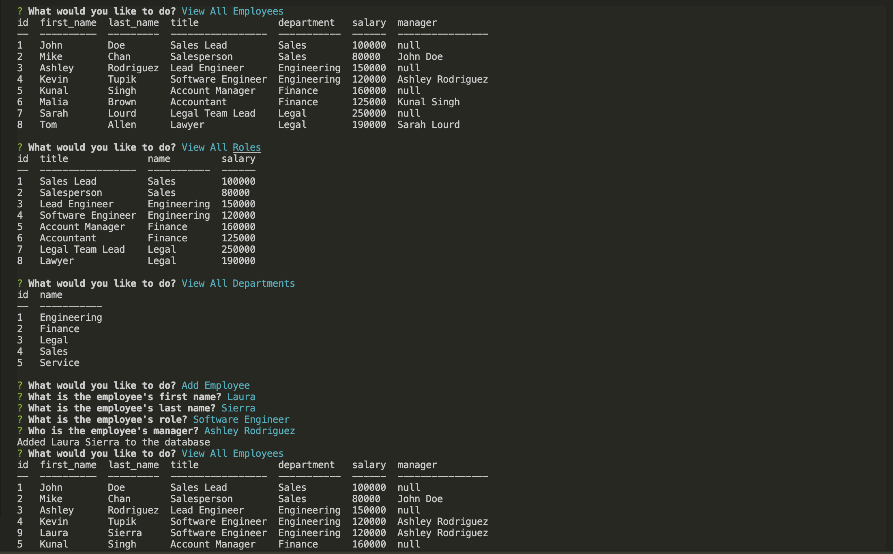

# Employee Tracker App
[](https://opensource.org/licenses/MIT)

## Description
A command-line application from scratch to manage a company's employee database, using Node.js, Inquirer, and MySQL. Utilizing asynchronous functions, the application can successfully retrieve and insert information from and to the database, as well as accurately update data that is necessary throughout the duration of the prompt. The user is able to not only view current employees, roles, and departments stored in the database, but also add and update said information.

Here's the link to how it works: [click here](https://youtu.be/tS7874xxObc).

## Screenshots
How the application looks on the terminal:


# Table of Contents
* [Installation](#installation)
* [Usage](#usage)
* [License](#license)
* [Contributing](#contributing)
* [Technologies Used](#technologies-used)
* [Code Snippets](#code-snippets)
* [Questions](#questions)
* [User Information](#user-information)

## Installation
To install necessary dependencies, run the following command:
```
npm i
```

## Usage
Install the dependencies and you're ready to go.

## License 
This project is licensed under the MIT license.

## Contributing
Contact me.

## Technologies Used
- Node.js
- Inquirer
- MySQL
- Console.table package

## Code Snippets
```javascript
// ----------------- Functions used to update the arrays containing employees, roles, and departments ----------------------
// retrieve current employee list
async function getEmployeeList() {
    return mydb.getEmployeeList().then(data => data[0].forEach(employee => employeeList.push(employee.employee)));
}
// retrieve current roles list
async function getRolesList() {
    return mydb.getRolesList().then(data => data[0].forEach(role => roleList.push(role.title)));
}
// retrieve current department list
async function getDepartmentsList() {
    return mydb.getDepartmentsList().then(data => data[0].forEach(dept => departmentList.push(dept.name)));
}

// ...Several lines of code later

// Initializes application with the prompts
function init() {
    // Update lists every time we run these questions
    getEmployeeList().then();
    getRolesList().then();
    getDepartmentsList().then()

    // Questionnaire for user
    inquirer.prompt(
        {
            type: "list",
            message: "What would you like to do?",
            choices: choices,
            name: "action"
        }
    ).then(response => {
        if (response.action === "Quit") process.exit(0);
        renderChoice(response.action);
    })
}

// Commence mysql and iquirer as soon as the project runs
init();

```
Throughout the prompt, the user needs to have the most updated list of employees, roles, and departments to further accurately manipulate the relationship between these tables. To do so, we can call `getEmployeeList`, `getRolesList`, `getDepartmentsList` as soon as the menu shows up on the user terminal. To achieve this, I have utilized asynchronous functions to connect to the database, parse the data, and push its designated arrays. Upone every iteration, these functions will get called and update the lists that are used within the prompt.


## Questions
If you have any questions about the repo, open an issue or contact me directly at laura.sierra17@gmail.com.
You can find more of my work at [laurasierra17](https://www.github.com/laurasierra17).

## User Information
- [LinkedIn](https://www.linkedin.com/in/laurasierra2022)
- [Portfolio](http://www.laura-sierra.com)